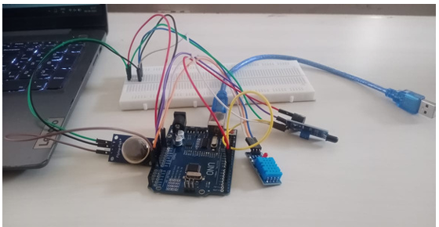

# 🔥 Fire Alarm System Using Arduino

## 📋 Abstract
This system uses an Arduino UNO with smoke, flame, and temperature sensors (like MQ, KY-026, and DHT11) to detect early signs of fire. If any sensor detects danger—like smoke, high heat, or flame—a buzzer sounds and an LED flashes to alert people nearby. It's a low-cost, real-time safety system ideal for homes, offices, and industries.

The system can later be upgraded with IoT, GSM alerts, or remote monitoring for better safety and automation.

## ⚙️ Components Used
- Arduino UNO
- MQ Series Smoke Sensor
- KY-026 Flame Sensor
- DHT11 Temperature Sensor
- LED
- Buzzer
- Jumper Wires
- Breadboard

## 🖼️ Project Diagram

## 💡 Working Principle
1. Sensors constantly monitor for smoke, heat, and flame.
2. If any abnormal condition is detected:
   - A buzzer sounds
   - LED blinks
3. Can be enhanced with cloud or GSM-based alerts.

## 📦 Future Scope
- IoT monitoring using ESP8266
- GSM alerts with SIM800L
- Real-time dashboard alerts

## 📁 Folder Structure
